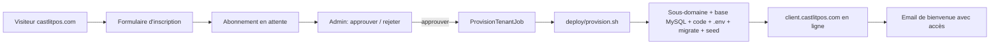
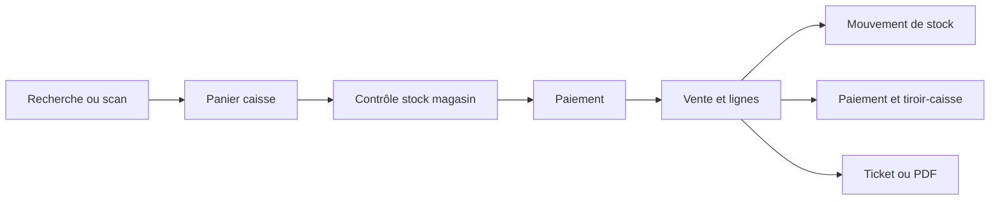
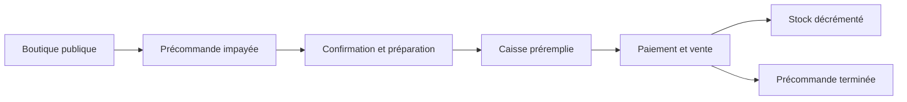
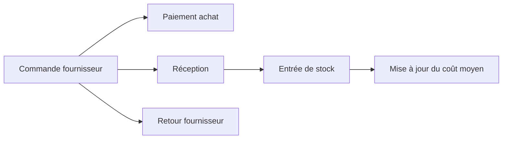

# Castl-it-POS

**Castl-it-POS** est une plateforme SaaS de caisse et de gestion pour les commerces marocains — librairies et papeteries, cafés et restaurants, pharmacies et parapharmacies, drogueries et commerces de détail. Elle réunit dans une même application le catalogue, la caisse tactile, le stock multi-magasin, les précommandes web, les achats, la facturation, la relation client, la fidélité et le pilotage financier.

Le produit est commercialisé sur **[castlitpos.com](https://castlitpos.com)** : chaque client obtient son propre espace sur `saboutique.castlitpos.com`. L'application est pensée pour les réalités marocaines : prix en MAD, interface française et arabe, gestion des ISBN et codes-barres, TVA et ICE, commandes WhatsApp/web, retrait en magasin, avances client, tiroir-caisse et documents commerciaux.

> **Dépôts.** Le back-office et l'API vivent dans ce dépôt (`NazLibra`, nom historique du code). L'application mobile de caisse est le projet Flutter **`naz_pos`**. Les composants internes (`LibraireProController`, `resources/views/librairepro/`) conservent leur nom d'origine ; le nom produit visible est **Castl-it-POS**.

## Objectifs métier

- centraliser les articles, livres, services, catégories, marques, variantes et prix ;
- vendre rapidement depuis une caisse POS avec scanner, panier, remises et paiements mixtes ;
- suivre le stock réel par magasin ou emplacement, en ligne comme hors ligne ;
- transformer une précommande ou une facture en vente sans double mouvement de stock ;
- gérer les fournisseurs, achats, réceptions et retours ;
- produire des devis, factures, tickets et PDF conformes (TVA, ICE) ;
- suivre clients, avances, coupons, fidélité, dépenses, comptes et trésorerie ;
- contrôler les accès par tenant, rôle, magasin et appareil virtuel ;
- fournir des tableaux de bord, rapports et traces d'audit ;
- livrer chaque client sur son propre sous-domaine, provisionné automatiquement.

## Principes fonctionnels importants

### La caisse est l'unique point d'encaissement

Toute opération qui doit produire une vente passe par **`/caisse`**. Les précommandes et factures ouvrent la caisse avec le client et les articles préchargés. L'ancien écran de vente manuelle redirige également vers la caisse. Cette règle garantit que le paiement, le mouvement de stock, le ticket, le tiroir-caisse et les contrôles d'idempotence utilisent le même flux.

### Le stock est géré par emplacement

La source opérationnelle du stock est `item_location_stocks`, identifiée par tenant, article, variante et emplacement. Les ventes, réceptions, retours, ajustements, transferts et inventaires produisent des mouvements traçables.

- une vente contrôle le stock du magasin courant ;
- un service n'a pas de stock physique ;
- le stock négatif est bloqué sauf si l'oversell est explicitement autorisé (réglage `pos.show_out_of_stock` / `allow_oversell`) ;
- une opération refusée ne crée ni vente ni mouvement partiel ;
- les clés d'idempotence empêchent de rejouer une transaction ;
- une précommande ne décrémente pas le stock avant son encaissement en caisse.

### Les documents source restent liés à la vente

Une vente issue d'une facture ou d'une précommande conserve son document source. Une contrainte métier empêche de convertir deux fois le même document. Si une vente existe déjà, l'application la rouvre au lieu de créer une seconde sortie de stock.

## Modules

| Domaine | Capacités principales |
| --- | --- |
| Tableau de bord | KPIs, activité, alertes, raccourcis et centre d'action |
| Catalogue | Livres, produits, services, ISBN, codes-barres, catégories, marques, unités, taxes, variantes, imports et étiquettes |
| Caisse & ventes | Recherche/scanner, panier, client, remises, coupons, paiements mixtes, tickets en attente, reçus, retours et remboursements |
| Boutique en ligne | Catalogue public, filtres, disponibilité par magasin, panier et création de précommandes |
| Précommandes | Commandes web, WhatsApp, téléphone ou magasin, suivi de préparation et conversion via la caisse |
| Stock | Stock par emplacement, mouvements, réservations, ajustements, transferts, inventaires et valorisation |
| Facturation | Devis, factures, paiements, remises fixes/%, HT/TTC, statuts, duplication, archivage, conversion et PDF |
| Achats | Commandes fournisseur, paiements, réception en stock, coûts et retours d'achat |
| Contacts (CRM) | Clients, fournisseurs, coordonnées, historique, crédit, avance, imports et segmentation |
| Fidélité | Points de fidélité, cumul et utilisation à la caisse |
| Finance | Avances client, dépenses, catégories, comptes, dépôts, transferts et transactions |
| Promotions | Coupons, coupons client et règles de remise conditionnelles |
| Tiroir-caisse | Ouverture, entrées/sorties d'espèces, solde attendu et clôture |
| Livraisons | Bons de livraison, adresses, préparation, expédition et suivi |
| Rapports | Ventes, achats, stock, finance et performance |
| Administration | Société, magasins, modules, thème, rôles, utilisateurs, appareils, documents et messagerie |
| Audit & sécurité | Historique utilisateur, appareil virtuel, terminal réel, verrouillage PIN et contrôle des permissions |
| Plateforme SaaS | Site marketing, inscriptions, validation et provisioning automatique des clients (voir plus bas) |

Les modules activables et leur ordre sont définis dans [`app/Support/AppModules.php`](app/Support/AppModules.php).

## Plateforme SaaS & multi-installation

L'installation **maître** (castlitpos.com, `CASTLIT_MASTER=true`) porte le site marketing public, le formulaire d'inscription et l'espace d'administration des abonnements. Chaque client approuvé reçoit **une installation dédiée** sur son propre sous-domaine, provisionnée automatiquement.



- **Site marketing** : `castlit/layout.blade.php` + `landing.blade.php`, optimisés SEO (title, meta, canonical, Open Graph, Twitter, JSON-LD `Organization`/`WebSite`/`SoftwareApplication`/`FAQPage`, image OG générée, `robots.txt`, `sitemap.xml`, `humans.txt`, `/.well-known/security.txt`). Voir `app/Http/Controllers/Castlit/MarketingController.php`.
- **Inscriptions & admin** : `SubscriptionController` (formulaire public, validation, honeypot, anti-spam), `SubscriptionAdminController` (liste, approbation, rejet, relance), protégés par le middleware `platform.admin` (`users.is_platform_admin`).
- **Provisioning** : `App\Jobs\ProvisionTenantJob` pilote `deploy/provision.sh` (cPanel/LWS) qui crée le sous-domaine (`uapi SubDomain`), la base et l'utilisateur MySQL (`uapi Mysql`), exporte le code (`git archive`), copie `vendor/`, rend `.env`, exécute `key:generate` / `migrate --force`, puis `php artisan castlit:install-tenant` (via `TenantProvisioningService`) pour créer le tenant + propriétaire depuis l'inscription.
- **Configuration** : [`config/castlit.php`](config/castlit.php) (marque, domaine, SEO, réservations de sous-domaines, paramètres d'hôte). Le drapeau `is_master` laisse ces routes dormantes sur les installations client — `/` y reste l'application POS normale, et leur `robots.txt` bloque l'indexation.

## Application mobile de caisse (`naz_pos`, Flutter)

L'application Flutter **`naz_pos`** est une caisse **offline-first** : les ventes, ajustements et créations fonctionnent sans connexion et se synchronisent au retour du réseau via l'API `/api/v1/sync/*` (voir le contrat de synchronisation ci-dessous). Elle gère le catalogue, le panier, les paiements, l'impression ESC/POS, les appareils virtuels, la fidélité et les réglages synchronisés depuis le serveur.

## Parcours métier

### Vente comptoir



### Précommande en ligne



### Achat et réception



## Architecture technique

Le back-office est un **monolithe modulaire Laravel**. Les domaines partagent la même application et la même base, tout en isolant les règles sensibles dans des services dédiés.

```text
app/
├── Http/
│   ├── Controllers/
│   │   ├── Castlit/        Site marketing, inscriptions et admin SaaS
│   │   ├── Api/            API mobile et synchronisation offline
│   │   └── ...             Back-office, caisse, boutique et documents
│   └── Middleware/         Tenant, permissions, session, appareil, platform.admin
├── Jobs/                   ProvisionTenantJob (provisioning client)
├── Models/                 Modèles Eloquent du domaine
├── Services/
│   ├── Inventory/          Stock atomique, réservations et mouvements
│   ├── Documents/          Calcul, numérotation, audit, devis et factures
│   ├── TenantProvisioningService.php
│   ├── LoyaltyService.php
│   └── CashRegisterService.php
├── Console/Commands/       castlit:install-tenant, roles:ensure-system
└── Support/                Tenant, modules, langue, horloge et mode métier

resources/
├── views/librairepro/      Back-office, caisse, catalogue et modules
├── views/castlit/          Site marketing, inscription et admin SaaS
├── views/storefront/       Boutique publique
├── css/app.css             Styles Tailwind et composants applicatifs
└── js/app.js               Interactions POS, factures, tableaux et interface

deploy/provision.sh         Provisioning cPanel/LWS d'une installation client
config/castlit.php          Marque, domaine, SEO et paramètres de provisioning
database/migrations/        Schéma et évolutions fonctionnelles
routes/web.php              Routes métier, SaaS et compatibilité des anciennes URLs
tests/Feature/              Tests des parcours complets

(dépôt séparé) naz_pos/     Application mobile de caisse Flutter (offline-first)
```

### Services métier

- `InventoryService` verrouille les lignes de stock et exécute les mouvements dans des transactions atomiques ;
- `CashRegisterService` centralise les sessions et mouvements du tiroir-caisse ;
- `InvoiceService` et `EstimateService` gèrent le cycle de vie des documents ; `CommercialDocumentCalculator` calcule lignes, remises (fixes/%), taxes (HT/TTC) et totaux ; `DocumentNumberGenerator` et `DocumentAuditTrail` assurent numérotation et traçabilité ;
- `LoyaltyService` gère le cumul et l'utilisation des points de fidélité ;
- `TenantProvisioningService` crée un tenant complet (réglages, rôles, propriétaire, emplacements, catégories, défauts) — utilisé par le provisioning et le wizard d'installation.

### Données et multi-tenant

Les enregistrements métier portent un `tenant_id`. `TenantContext` détermine l'organisation courante et `EnsureTenantAccess` contrôle les modules et permissions. Les opérations critiques utilisent des transactions SQL, des verrous de ligne et, lorsque nécessaire, des clés d'idempotence. Toutes les migrations et le SQL brut sont compatibles **SQLite (dev)** et **MySQL/MariaDB (prod)**.

## Stack

- PHP 8.3+, Laravel 13, Blade
- Tailwind CSS 4, Vite, JavaScript ES modules
- Eloquent ORM ; SQLite par défaut, MySQL/MariaDB en production
- Yajra DataTables, Dompdf (PDF), GD (image OG)
- Sanctum (API mobile), file d'attente base de données
- PHPUnit 12
- Application mobile : Flutter / Dart (dépôt `naz_pos`)

## Installation locale

### Prérequis

- PHP 8.3+ avec les extensions Laravel (dont `gd`) ; Composer ; Node.js et npm ; SQLite, MySQL ou MariaDB.

### Installation rapide

```bash
git clone <url-du-depot>
cd NazLibra
composer run setup
php artisan db:seed
```

`composer run setup` installe les dépendances PHP/JS, crée `.env`, génère la clé, migre et compile les assets. Pour SQLite :

```bash
touch database/database.sqlite
```

Vérifiez dans `.env` :

```dotenv
APP_NAME="Castl-it-POS"
APP_URL=http://127.0.0.1:8000
DB_CONNECTION=sqlite
CLIENT_BUSINESS_MODE=bookstore
CLIENT_TIMEZONE=Africa/Casablanca
CLIENT_CURRENCY=MAD
CLIENT_LANGUAGE=fr

# Site marketing SaaS (installation maître uniquement)
CASTLIT_MASTER=false
CASTLIT_MAIN_DOMAIN=castlitpos.com
CASTLIT_CONTACT_EMAIL=contact@castlitpos.com
CASTLIT_GSC_VERIFICATION=
```

Réinitialiser une base locale avec les données de démonstration (jamais sur des données utiles) :

```bash
php artisan migrate:fresh --seed
```

## Développement

```bash
composer run dev        # serveur, Vite, queue et logs
```

| URL | Usage |
| --- | --- |
| `/` | Tableau de bord (client) **ou** site marketing (installation maître) |
| `/caisse` | Point de vente et encaissement |
| `/catalogue` | Catalogue et gestion du stock |
| `/modules/{module}` | Modules du back-office |
| `/boutique` | Boutique publique |
| `/castlit-admin` | Administration des abonnements (installation maître) |
| `/robots.txt`, `/sitemap.xml` | SEO (maître : indexable ; client : bloqué) |
| `/telescope` | Debug local des requêtes, exceptions, SQL, jobs et mails |

### Attribution sécurisée des actions POS

Les mutations POS auditables utilisent l'identité du jeton Sanctum et l'en-tête `X-Virtual-Device-Id`. Quand `features.virtual_devices` est activé, cet en-tête est obligatoire. Le terminal doit être actif, appartenir au tenant authentifié et être compatible avec l'emplacement courant. Un `user_id` envoyé dans une mutation est refusé : l'opérateur est toujours dérivé du jeton.

`POST /api/v1/auth/pin-verify` reçoit `user_id` et `pin` uniquement pour authentifier le changement d'opérateur. En cas de succès, la réponse contient `token`, `token_type`, `user` et `abilities`. Le client remplace son ancien jeton par ce nouveau jeton avant toute action. Seul le jeton ayant servi au changement est révoqué. Tous les PIN sont exactement composés de quatre chiffres ASCII (`0000` à `9999`).

Les ventes exposent l'attribution dans toutes les réponses de création, rejeu idempotent, liste, détail et synchronisation :

```json
{
  "created_by": { "id": 2, "name": "Youssef Benali" },
  "virtual_device": { "id": 4, "name": "Tablette comptoir" }
}
```

### Contrat de synchronisation offline

Les collections paginées (`items`, `contacts`, `sales`, `invoices`, `contact-transactions`) utilisent un curseur opaque émis par le serveur. La première requête accepte `since` et `per_page` ; les suivantes transmettent uniquement `cursor=<next_cursor>`. Toutes les pages conservent le même `sync_at` et sont ordonnées par `(updated_at, id)`. Le client ne sauvegarde `sync_at` comme prochain curseur delta qu'après réception de `has_more: false`.

Tous les instants échangés par l'API sont normalisés en UTC (RFC 3339 avec `Z` ou décalage explicite ; une date sans décalage retourne HTTP 422). Le fuseau du tenant sert uniquement à l'affichage. Laravel et les sessions MySQL/MariaDB stockent en UTC (`DB_TIMEZONE=+00:00`).

```json
{
  "ok": true,
  "sync_at": "2026-06-23T12:00:00.000000Z",
  "page": 1,
  "per_page": 200,
  "total": 450,
  "has_more": true,
  "next_cursor": "opaque-server-cursor",
  "items": []
}
```

| Endpoint | Portée et contenu |
| --- | --- |
| `/api/v1/sync/settings` | Tenant et emplacement résolus ; réponse non paginée. |
| `/api/v1/sync/meta` | Catégories, marques, unités et taxes du tenant, tombstones `deleted_at`. |
| `/api/v1/sync/items` | Catalogue tenant avec `external_id` (UUID local Flutter), tombstones, curseur. |
| `/api/v1/sync/stock` | Snapshot complet ou delta de l'emplacement courant ; `is_full_snapshot` + tombstones. |
| `/api/v1/sync/contacts` | Contacts tenant, tombstones, filtre `kind` inclus dans l'identité du curseur. |
| `/api/v1/sync/sales` | Ventes de l'emplacement courant, attribution utilisateur/terminal et tombstones. |
| `/api/v1/sync/invoices` | Factures de vente liées à l'emplacement courant, tombstones. |
| `/api/v1/sync/contact-transactions` | Grand livre tenant, tombstones et pagination par curseur. |

Un `since`, `cursor`, `per_page` ou emplacement invalide retourne HTTP 422. Les mutations offline doivent fournir une clé d'idempotence stable ; une même clé avec un payload différent retourne HTTP 409 `idempotency_conflict`. La création mobile `POST /api/v1/items` exige `local_id` (UUID), conservé dans `items.external_id` (unique par tenant) : première création HTTP 201 `already_existed: false`, rejeu HTTP 200 `already_existed: true`.

## Déploiement (cPanel / LWS)

L'application se déploie depuis GitHub. L'installation maître et chaque client partagent le même code ; seul l'environnement (`.env`) diffère.

1. Cloner le dépôt dans un cache serveur et y exécuter `composer install --no-dev -o` (vendor prêt à copier). Les assets `public/build/` sont versionnés.
2. Installation **maître** : `.env` avec `CASTLIT_MASTER=true`, DNS wildcard `*.castlitpos.com`, un utilisateur `is_platform_admin`, `CASTLIT_GITHUB_TOKEN` et les chemins d'hôte de `config/castlit.php`.
3. Faire tourner un worker de file d'attente (`php artisan queue:work`) ou un cron : l'approbation d'un abonnement y déclenche `ProvisionTenantJob`.
4. Chaque approbation crée automatiquement le sous-domaine, la base, le code et le tenant du client. Voir [`deploy/provision.sh`](deploy/provision.sh).

## Tests et qualité

```bash
composer test                                   # toute la suite (SQLite en mémoire)
php artisan test tests/Feature/PosTest.php      # un domaine
php artisan test tests/Feature/CommercialDocumentTest.php
./vendor/bin/pint --test                        # style PHP
npm run build                                   # assets de production
```

Les tests utilisent SQLite en mémoire et les transports mail/queue de test de `phpunit.xml`.

## Conventions de développement

- toute requête métier doit être limitée au tenant courant ;
- une vente interactive doit passer par `/caisse` ;
- toute variation de stock doit passer par `InventoryService` et produire un mouvement ;
- les opérations financières ou de stock doivent être transactionnelles ; aucune écriture partielle en cas d'échec ;
- les conversions de documents doivent rester idempotentes ;
- migrations et SQL brut compatibles SQLite **et** MySQL (préférer `COALESCE`, `CASE WHEN`, gardes `Schema::getIndexes()`) ;
- les textes visibles doivent rester compatibles français et arabe ;
- tout nouveau parcours critique doit avoir un test Feature.

## Sécurité et audit

- authentification Laravel avec réinitialisation du mot de passe et du PIN ;
- rôles et permissions par tenant ; administration plateforme via `is_platform_admin` ;
- accès utilisateur limité aux magasins autorisés ; verrouillage de session caisse ;
- sélection et suivi d'appareils virtuels (une session live par appareil) ;
- journal d'audit (utilisateur, action, sujet, appareil, contexte) ;
- `/.well-known/security.txt` pour le signalement de vulnérabilités.

Ne placez jamais de secrets, mots de passe clients ou identifiants SMTP réels dans le dépôt.

## État du projet

Version bêta (`1.0.0-beta.5`). Les parcours principaux sont couverts par des tests Feature ; une validation en préproduction reste recommandée avant mise en service (impression, matériel POS, emails, permissions, sauvegardes, multi-magasin et provisioning).

## Licence

Ce dépôt utilise Laravel, distribué sous licence MIT. La licence applicable au code métier Castl-it-POS doit être définie par le propriétaire du projet avant toute distribution publique.
