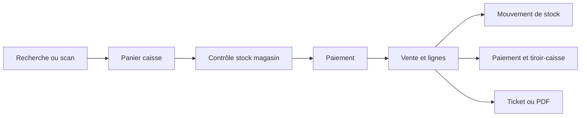
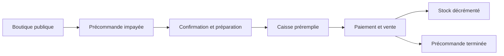
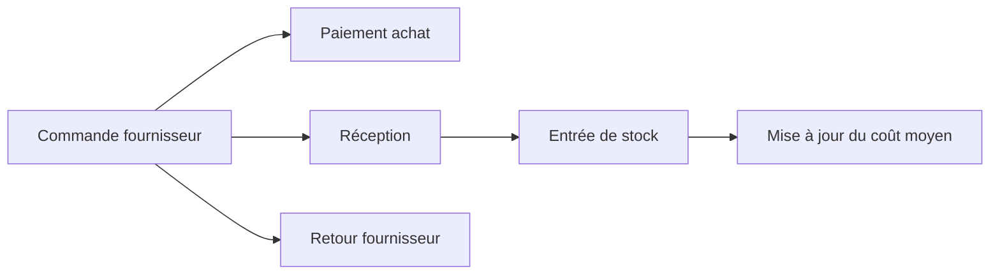

# NazLibra / LibrairePro

NazLibra, présenté dans l’application sous le nom **LibrairePro**, est une plateforme SaaS de gestion destinée aux librairies, papeteries et commerces culturels. Elle réunit dans une même application le catalogue, la caisse, le stock multi-magasin, les précommandes web, les achats, la facturation, la relation client et le pilotage financier.

Le projet est pensé pour les réalités d’une librairie marocaine : prix en MAD, interface française et arabe, gestion des ISBN et codes-barres, livres et fournitures, commandes WhatsApp/web, retrait en magasin, avances client, tiroir-caisse et documents commerciaux.

## Objectifs métier

LibrairePro vise à fournir un parcours cohérent de bout en bout :

- centraliser les articles, livres, services, catégories, marques, variantes et prix ;
- vendre rapidement depuis une caisse POS avec scanner, panier, remises et paiements mixtes ;
- suivre le stock réel par magasin ou emplacement ;
- transformer une précommande ou une facture en vente sans double mouvement de stock ;
- gérer les fournisseurs, achats, réceptions et retours ;
- produire des devis, factures, tickets et PDF ;
- suivre clients, avances, coupons, dépenses, comptes et trésorerie ;
- contrôler les accès par tenant, rôle, magasin et appareil virtuel ;
- fournir des tableaux de bord, rapports et traces d’audit.

## Principes fonctionnels importants

### La caisse est l’unique point d’encaissement

Toute opération qui doit produire une vente passe par **`/caisse`**. Les précommandes et factures ouvrent la caisse avec le client et les articles préchargés. L’ancien écran de vente manuelle redirige également vers la caisse.

Cette règle garantit que le paiement, le mouvement de stock, le ticket, le tiroir-caisse et les contrôles d’idempotence utilisent le même flux.

### Le stock est géré par emplacement

La source opérationnelle du stock est `item_location_stocks`, identifiée par tenant, article, variante et emplacement. Les ventes, réceptions, retours, ajustements, transferts et inventaires produisent des mouvements traçables.

- une vente contrôle le stock du magasin courant ;
- un service n’a pas de stock physique ;
- le stock négatif est bloqué sauf si l’oversell est explicitement autorisé ;
- une opération refusée ne crée ni vente ni mouvement partiel ;
- les clés d’idempotence empêchent de rejouer une transaction ;
- une précommande ne décrémente pas le stock avant son encaissement en caisse.

### Les documents source restent liés à la vente

Une vente issue d’une facture ou d’une précommande conserve son document source. Une contrainte métier empêche de convertir deux fois le même document. Si une vente existe déjà, l’application la rouvre au lieu de créer une seconde sortie de stock.

## Modules

| Domaine | Capacités principales |
| --- | --- |
| Tableau de bord | KPIs, activité, alertes, raccourcis et centre d’action |
| Catalogue | Livres, produits, services, ISBN, codes-barres, catégories, marques, unités, taxes, variantes, imports et étiquettes |
| Caisse & ventes | Recherche/scanner, panier, client, remises, coupons, paiements mixtes, tickets en attente, reçus, retours et remboursements |
| Boutique en ligne | Catalogue public, filtres, disponibilité par magasin, panier et création de précommandes |
| Précommandes | Commandes web, WhatsApp, téléphone ou magasin, suivi de préparation et conversion via la caisse |
| Stock | Stock par emplacement, mouvements, réservations, ajustements, transferts, inventaires et valorisation |
| Facturation | Devis, factures, paiements, statuts, duplication, archivage, conversion et PDF |
| Achats | Commandes fournisseur, paiements, réception en stock, coûts et retours d’achat |
| Contacts | Clients, fournisseurs, coordonnées, historique, crédit, avance, imports et segmentation |
| Finance | Avances client, dépenses, catégories, comptes, dépôts, transferts et transactions |
| Promotions | Coupons, coupons client et règles de remise conditionnelles |
| Tiroir-caisse | Ouverture, entrées/sorties d’espèces, solde attendu et clôture |
| Livraisons | Bons de livraison, adresses, préparation, expédition et suivi |
| Emprunts | Prêts, retours, pénalités et réservations ; module optionnel |
| Rapports | Ventes, achats, stock, finance et performance |
| Administration | Société, magasins, modules, thème, rôles, utilisateurs, appareils, documents et messagerie |
| Audit & sécurité | Historique utilisateur, appareil virtuel, terminal réel, verrouillage PIN et contrôle des permissions |

Les modules activables et leur ordre sont définis dans [`app/Support/AppModules.php`](app/Support/AppModules.php).

## Parcours métier

### Vente comptoir



### Précommande en ligne



### Achat et réception



## Architecture technique

Le projet est un **monolithe modulaire Laravel**. Les domaines partagent la même application et la même base, tout en isolant les règles sensibles dans des services dédiés.

```text
app/
├── Http/
│   ├── Controllers/       Contrôleurs web, POS, boutique et documents
│   └── Middleware/        Tenant, permissions, session, appareil et audit
├── Models/                Modèles Eloquent du domaine
├── Services/
│   ├── Inventory/         Stock atomique, réservations et mouvements
│   ├── Documents/         Calcul, numérotation, audit, devis et factures
│   └── CashRegisterService.php
└── Support/               Tenant, modules, langue, horloge et mode métier

resources/
├── views/librairepro/     Back-office, caisse, catalogue et modules
├── views/storefront/      Boutique publique
├── views/components/      Layout et composants Blade partagés
├── css/app.css            Styles Tailwind et composants applicatifs
└── js/app.js              Interactions POS, tableaux et interface

database/
├── migrations/            Schéma et évolutions fonctionnelles
├── seeders/               Données initiales, tenant client et démonstration
└── factories/             Fabriques de tests

routes/web.php             Routes métier et compatibilité des anciennes URLs
tests/Feature/             Tests des parcours complets
```

### Couche HTTP

- `LibraireProController` orchestre la majorité des écrans et opérations du back-office.
- `OnlineStoreController` gère la boutique publique et la création des commandes web.
- `CommercialDocumentController` gère les devis et factures commerciales.
- les middlewares appliquent le contexte tenant, les permissions, le magasin/appareil courant, le verrouillage de session et l’audit.

### Services métier

- `InventoryService` verrouille les lignes de stock et exécute les mouvements dans des transactions atomiques ;
- `CashRegisterService` centralise les sessions et mouvements du tiroir-caisse ;
- `InvoiceService` et `EstimateService` gèrent le cycle de vie des documents ;
- `CommercialDocumentCalculator` calcule lignes, remises, taxes et totaux ;
- `DocumentNumberGenerator` et `DocumentAuditTrail` assurent numérotation et traçabilité.

### Données et multi-tenant

Les enregistrements métier portent un `tenant_id`. `TenantContext` détermine l’organisation courante et `EnsureTenantAccess` contrôle les modules et permissions. Les magasins sont associés à des emplacements de stock et les utilisateurs peuvent avoir un accès limité à certains magasins.

Les opérations critiques utilisent des transactions SQL, des verrous de ligne et, lorsque nécessaire, des clés d’idempotence.

## Stack

- PHP 8.3+
- Laravel 13
- Blade
- Tailwind CSS 4
- Vite 8
- JavaScript ES modules
- Eloquent ORM
- SQLite par défaut ; MySQL/MariaDB configurable
- Yajra DataTables et DataTables.net
- Dompdf pour les documents PDF
- PHPUnit 12

## Installation locale

### Prérequis

- PHP 8.3 ou supérieur avec les extensions requises par Laravel ;
- Composer ;
- Node.js et npm ;
- SQLite, MySQL ou MariaDB.

### Installation rapide

```bash
git clone <url-du-depot>
cd NazLibra
composer run setup
php artisan db:seed
```

Le script `composer run setup` installe les dépendances PHP et JavaScript, crée `.env`, génère la clé applicative, exécute les migrations et compile les assets.

Pour SQLite, créez le fichier si nécessaire :

```bash
touch database/database.sqlite
```

Vérifiez ensuite dans `.env` :

```dotenv
APP_NAME=LibrairePro
APP_URL=http://127.0.0.1:8000
DB_CONNECTION=sqlite
CLIENT_BUSINESS_MODE=bookstore
CLIENT_TIMEZONE=Africa/Casablanca
CLIENT_CURRENCY=MAD
CLIENT_LANGUAGE=fr
```

Pour réinitialiser une base locale avec les données de démonstration :

```bash
php artisan migrate:fresh --seed
```

N’utilisez pas cette commande sur une base contenant des données utiles.

## Développement

Démarrer le serveur Laravel, Vite, la queue et les logs :

```bash
composer run dev
```

Ou lancer séparément :

```bash
php artisan serve
npm run dev
php artisan queue:listen
```

URLs principales :

| URL | Usage |
| --- | --- |
| `/` | Tableau de bord après authentification |
| `/caisse` | Point de vente et encaissement |
| `/catalogue` | Catalogue et gestion du stock |
| `/modules/{module}` | Modules du back-office |
| `/boutique` | Boutique publique |
| `/modules/settings` | Configuration de l’organisation |
| `/telescope` | Debug local/dev des requêtes API, exceptions, requêtes SQL, logs, jobs et mails |

### Debug API avec Laravel Telescope

Telescope est installé en dépendance de développement pour inspecter les appels API et diagnostiquer les erreurs applicatives.

Variables utiles :

```env
TELESCOPE_ENABLED=true
TELESCOPE_PATH=telescope
TELESCOPE_ALLOWED_EMAILS=
TELESCOPE_ALLOW_OWNER_ROLE=true
```

En local, l’accès est direct pour faciliter le debug. Sur un environnement partagé, l’accès est limité aux utilisateurs `owner` du tenant courant ou aux emails listés dans `TELESCOPE_ALLOWED_EMAILS`.

### Attribution sécurisée des actions POS

Les mutations POS auditables utilisent l'identité du jeton Sanctum et l'en-tête `X-Virtual-Device-Id`. Quand `features.virtual_devices` est activé, cet en-tête est obligatoire. Le terminal doit être actif, appartenir au tenant authentifié et être compatible avec l'emplacement courant. Un `user_id` envoyé dans une mutation est refusé : l'opérateur est toujours dérivé du jeton.

`POST /api/v1/auth/pin-verify` reçoit `user_id` et `pin` uniquement pour authentifier le changement d'opérateur. En cas de succès, la réponse contient `token`, `token_type`, `user` et `abilities`. Le client doit remplacer son ancien jeton par ce nouveau jeton avant toute action. Seul le jeton ayant servi au changement est révoqué ; les autres sessions restent actives. Pour revenir à l'opérateur précédent, effectuer un nouveau `pin-verify` avec son PIN. `POST /api/v1/auth/logout` révoque uniquement le jeton courant.

Tous les PIN sont exactement composés de quatre chiffres ASCII (`0000` à `9999`). Les anciens hashes correspondant à des PIN de cinq ou six chiffres ne sont plus utilisables : leur propriétaire doit demander une réinitialisation du PIN ou faire définir un nouveau PIN à quatre chiffres par un propriétaire du tenant.

Les ventes exposent l'attribution dans toutes les réponses de création, rejeu idempotent, liste, détail et synchronisation :

```json
{
  "created_by": { "id": 2, "name": "Youssef Benali" },
  "virtual_device": { "id": 4, "name": "Tablette comptoir" }
}
```

### Contrat de synchronisation offline

Les collections paginées (`items`, `contacts`, `sales`, `invoices`, `contact-transactions`) utilisent un curseur opaque émis par le serveur. La première requête accepte `since` et `per_page`; les suivantes transmettent uniquement `cursor=<next_cursor>`. Toutes les pages conservent le même `sync_at` et sont ordonnées par `(updated_at, id)`. Le client ne sauvegarde `sync_at` comme prochain curseur delta qu'après réception de `has_more: false`.

```json
{
  "ok": true,
  "sync_at": "2026-06-23T12:00:00.000000Z",
  "page": 1,
  "per_page": 200,
  "total": 450,
  "has_more": true,
  "next_cursor": "opaque-server-cursor",
  "items": []
}
```

| Endpoint | Portée et contenu |
| --- | --- |
| `/api/v1/sync/settings` | Tenant et emplacement résolus; réponse non paginée avec `tenant_id`, `location_id`, `has_more: false`. |
| `/api/v1/sync/meta` | Catégories, marques, unités et taxes du tenant, tombstones `deleted_at`, ordre déterministe. |
| `/api/v1/sync/items` | Catalogue tenant, tombstones `deleted_at`, pagination par curseur. |
| `/api/v1/sync/stock` | Snapshot complet ou delta de l'emplacement courant; `is_full_snapshot` indique la sémantique de remplacement. |
| `/api/v1/sync/contacts` | Contacts tenant, tombstones, filtre `kind` inclus dans l'identité du curseur. |
| `/api/v1/sync/sales` | Ventes de l'emplacement courant, attribution utilisateur/terminal et tombstones. |
| `/api/v1/sync/invoices` | Factures de vente liées à l'emplacement courant, tombstones. |
| `/api/v1/sync/contact-transactions` | Grand livre tenant, tombstones et pagination par curseur. |

Un `since`, `cursor`, `per_page` ou emplacement invalide retourne HTTP 422. Les mutations offline doivent fournir une clé d'idempotence stable; une même clé avec un payload différent retourne HTTP 409 `idempotency_conflict` lorsqu'un hash de requête est pris en charge.

## Tests et qualité

Exécuter toute la suite :

```bash
composer test
```

Exécuter un domaine précis :

```bash
php artisan test tests/Feature/PosTest.php
php artisan test tests/Feature/OnlineOrderTest.php
php artisan test tests/Feature/PurchaseTest.php
php artisan test tests/Feature/FacturationModuleTest.php
```

Vérifier le style PHP :

```bash
./vendor/bin/pint --test
```

Compiler les assets de production :

```bash
npm run build
```

Les tests utilisent SQLite en mémoire, le cache et les sessions en mémoire, ainsi que les transports mail/queue de test configurés dans `phpunit.xml`.

## Conventions de développement

- toute requête métier doit être limitée au tenant courant ;
- une vente interactive doit passer par `/caisse` ;
- toute variation de stock doit passer par `InventoryService` et produire un mouvement ;
- les opérations financières ou de stock doivent être transactionnelles ;
- les conversions de documents doivent rester idempotentes ;
- un échec de validation ou de stock ne doit laisser aucune écriture partielle ;
- les services ne décrémentent jamais le stock ;
- les textes visibles doivent rester compatibles avec le français et l’arabe ;
- tout nouveau parcours critique doit avoir un test Feature.

## Configuration

Les principales variables sont documentées dans [`.env.example`](.env.example). Elles couvrent notamment :

- l’URL, la langue et la version de l’application ;
- la base de données, les sessions, le cache et les queues ;
- l’identité du tenant client et du propriétaire initial ;
- le mode métier, la devise, le pays et le fuseau horaire ;
- le mail et les intégrations externes.

Les paramètres modifiables depuis l’interface sont stockés dans les réglages du tenant : modules, thème, société, magasins, caisse, documents PDF, messagerie, rôles et références.

## Sécurité et audit

- authentification Laravel avec réinitialisation du mot de passe et du PIN ;
- rôles et permissions par tenant ;
- accès utilisateur limité aux magasins autorisés ;
- verrouillage de session caisse ;
- sélection et suivi d’appareils virtuels ;
- journal d’audit avec utilisateur, action, sujet, appareil et contexte de requête ;
- validation des identifiants de modèles dans le périmètre du tenant.

Ne placez jamais de secrets, mots de passe clients ou identifiants SMTP réels dans le dépôt.

## État du projet

Le projet est actuellement en version bêta (`1.0.0-beta.4`). Les parcours métier principaux sont couverts par des tests Feature, mais une validation sur environnement de préproduction reste recommandée avant toute mise en service : impression, matériel POS, emails, permissions, sauvegardes et comportement multi-magasin.

## Licence

Ce dépôt utilise Laravel, distribué sous licence MIT. La licence applicable au code métier NazLibra/LibrairePro doit être définie par le propriétaire du projet avant distribution publique.
